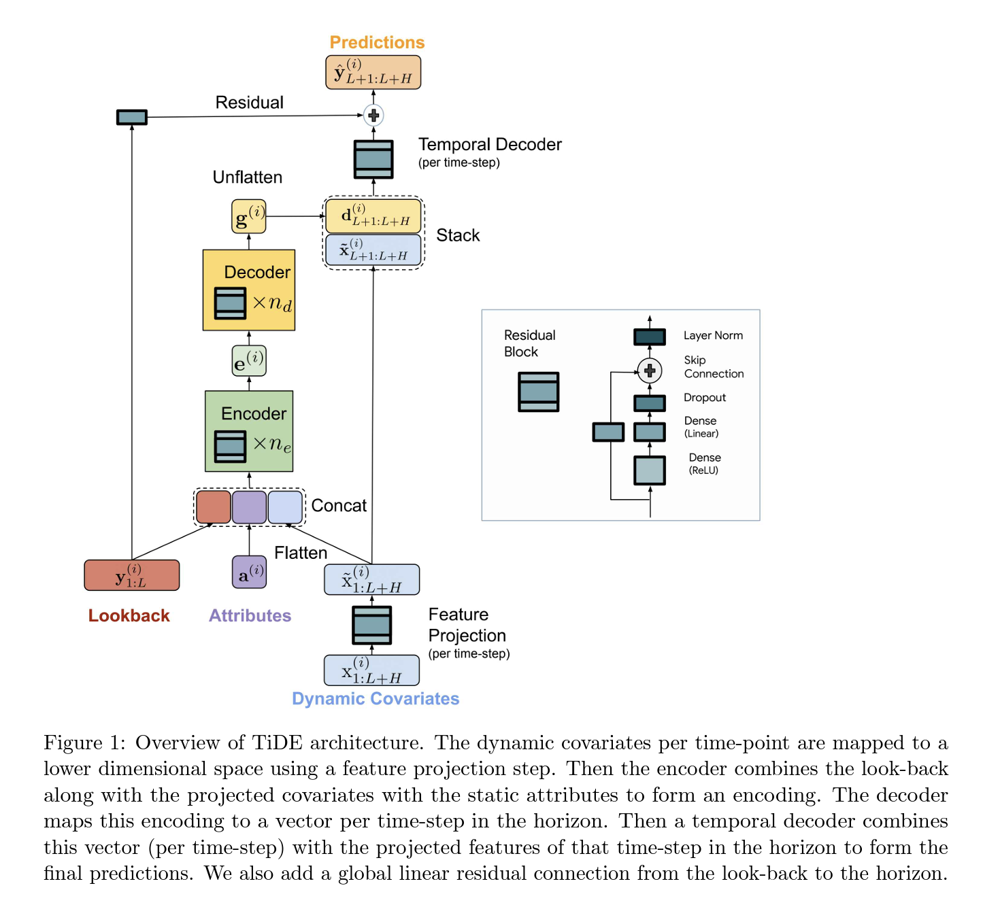

# TiDE
Implementation of Paper: Long-term Forecasting with TiDE: Time-series Dense Encoder  

Link to paper: [Long-term Forecasting with TiDE: Time-series Dense Encoder](https://arxiv.org/pdf/2304.08424.pdf)  

Related paper: [On the benefits of maximum likelihood estimation for Regression and Forecasting](https://openreview.net/pdf?id=zrW-LVXj2k1)

## Mapping function
$$
f : (\{y_{1: L}^{(i)}\}_{i=1}^{N}, \{x_{1:L+H}^{(i)}\}_{i=1}^{N}, \{a^{(i)}\}_{i=1}^{N}) \to \{\hat y_{L+1:L+H}^{(i)}\}_{i=1}^{N}
$$
